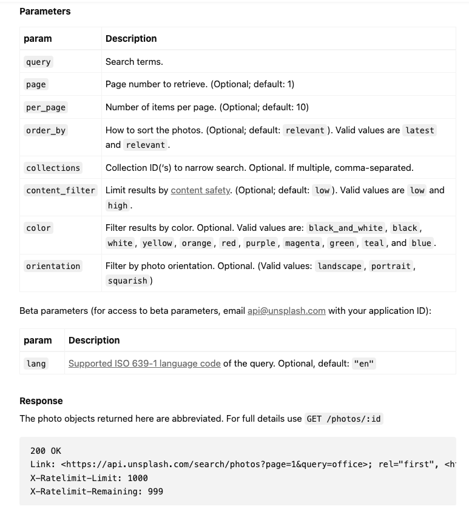

# React App Test

## Purpose and Function
1. To get API endpoints and Access Keys from the Unsplash developer's dashboard.
2. To use the useState and useEffect hooks to fetch data from the API.
3. To use the map function to display images or any other data from the API.

***

### Unsplash Parameters for image search:

***
### Conclusion
We develop a Photo Search app in React using the Unsplash API, using React Hooks (useState, useEffect) to get the data from an API and display images in our App.

There is much more you can do with this application to extend it. 

- Create a checkbox to toggle between searching for photos or the users that posted them according to the user’s preference
- Add an infinite scroll to display more images, and more.
- Add a Random button to display random images